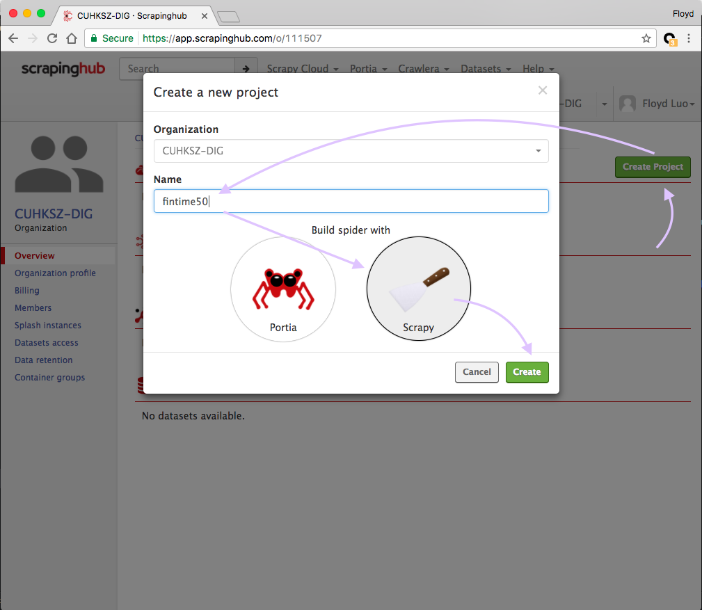
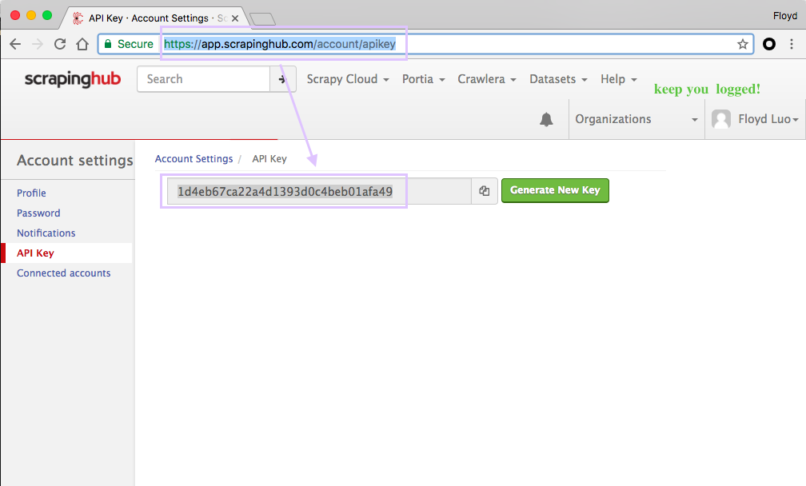
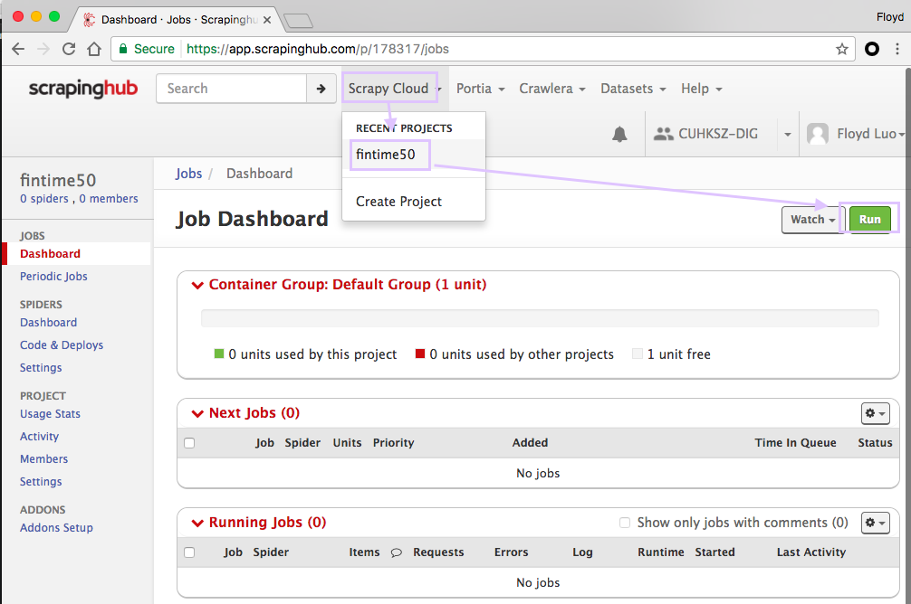
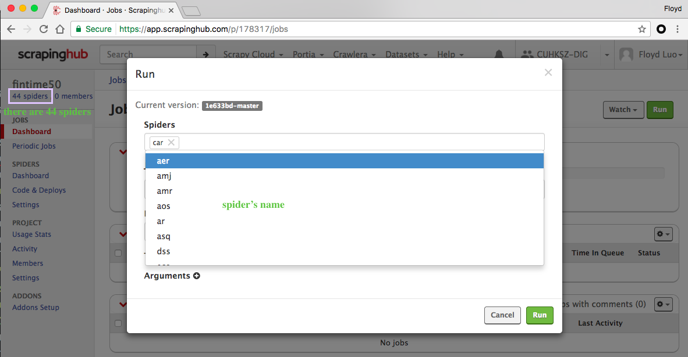

# Scrapinghub Tutorial

## 1 Prepare Scrapy

For the Source Code, visit:

https://github.com/udmis/pubcrawler.git


```bash
$ cd ./your/file/path/for/pubcrawler
$ git clone https://github.com/udmis/pubcrawler.git
```

## 2 Register Scrapinghub Account

Visit: https://scrapinghub.com/

Then register an account.

Then you will enter this page.

## 3 Create Scrapy Cloud Project




## 4 Authenticate into ScrapyCloud

```bash
$ pip install shub
$ shub login
Enter your API key from https://app.scrapinghub.com/account/apikey
API key:
```


Then copy and request the url: https://app.scrapinghub.com/account/apikey.

copy and account and enter, then you are logged.

```bash
$ shub login
Enter your API key from https://app.scrapinghub.com/account/apikey
API key: 1d4eb67ca22a4d1393d0c4beb01afa49
Validating API key...
API key is OK, you are logged in now.
```


## 5 Deploy Project to Scrapy Cloud

```bash
# cd to the correct directory

$ cd pubcrawler/fintime5
$ shub deploy
Target project ID: 178317
Save as default [Y/n]: y
Project 178317 was set as default in scrapinghub.yml. You can deploy to it via 'shub deploy' from now on.
Packing version 1e633bd-master
Deploying to Scrapy Cloud project "178317"
{"project": 178317, "spiders": 44, "status": "ok", "version": "1e633bd-master"}
Run your spiders at: https://app.scrapinghub.com/p/178317/
```

Then, on the webpage, you can see your spiders.




